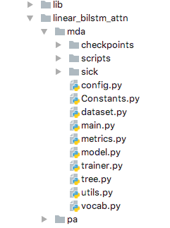

## Introduction
This repository has the code for ACL'18 paper: To Attend or not to Attend: A Case Study on Syntactic Structures for Semantic Relatedness by Amulya Gupta and Zhu Zhang.
Please use below for
* bibtex citation:
<pre lang="bibtex"><code>@INPROCEEDINGS {guptaamulyazhangzhu2018,
		author = {Gupta, Amulya and Zhang, Zhu},
		booktitle = {Proceedings of the 56th Annual Meeting of Association for Computational Linguistics},
		title  = {To Attend or not to Attend: A Case Study on Syntactic Structures for Semantic Relatedness},
		year   = {2018}}
</code></pre>
* APA citation:
> Gupta, A. and Zhang, Z. (2018). To Attend or not to Attend: A Case Study on Syntactic Structures for Semantic Relatedness. *Proceedings of the 56th Annual Meeting of Association for Computational Linguistics.*

## Dependencies
* Python (tested on 2.7.13)
* [Pytorch](http://pytorch.org/) (tested on 0.2.0_3)
* tqdm
* numpy (tested on 1.14.0)
* scipy (tested on 1.0.0)
* [SICK dataset](http://alt.qcri.org/semeval2014/task1/index.php?id=data-and-tools)
	* TestData (including gold scores)
	* TrainingData
	* TrialData
* [Glove embeddings](https://nlp.stanford.edu/projects/glove/)
	* Common Crawl (840B)
* I used this [library](https://iastate.box.com/s/o1izis36zlfsxvu8tzw5ij745xwbrcu9) which contains [Stanford Parser](http://nlp.stanford.edu/software/lex-parser.shtml), [Stanford POS Tagger](http://nlp.stanford.edu/software/tagger.shtml), [Stanford Dependency Parser](http://nlp.stanford.edu/software/nndep.shtml) and [Stanford Constituency Parser](https://nlp.stanford.edu/software/srparser.html).

## How to run the code?
Download any model(eg. linear_bilstm_attn) and please:
* Change value of  **default** in **–glove** argument in **config.py** to point to the location of downloaded Glove embeddings.
* Change path of following in **scripts/preprocess-sick.py** to point to downloaded train, trial and test datasets(make sure that all the files are converted into **csv** before use), respectively:
	* file0 ---- location of train dataset file
	* file1 ---- location of trial(dev) dataset file
	* file2 ---- location of test dataset file
* Put the downloaded **library(lib)** as shown above.

* Go to folder **scripts** and run command:
	* python preprocess-sick.py
	* If the command runs successfully, then you should see the output as follows:
	  
* Go to downloaded model folder and run command:
	* python main.py
	* If the command runs successfully, then you should see the output as follows:
	  

## Acknowledgement
The code in this repository is an adaptation of PyTorch implementation available at: [https://github.com/dasguptar/treelstm.pytorch].
